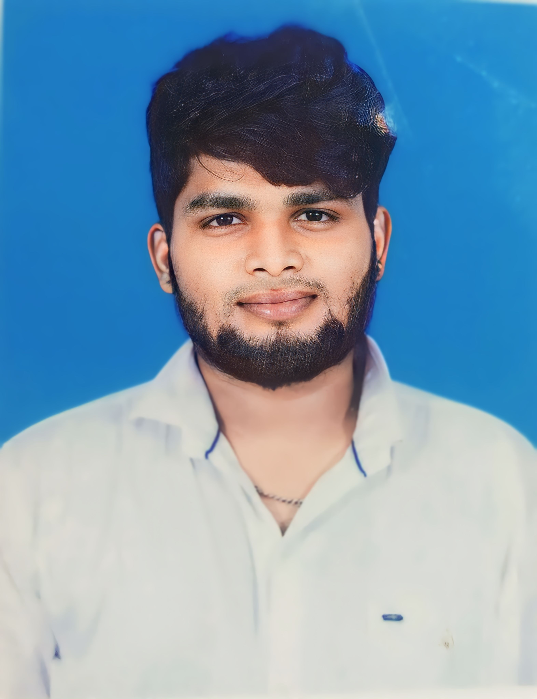

================================================================================================================================================
Task 2 is resume (using Bootstrap)
    HTML code :
    <!-- <!DOCTYPE html>
<!-- <html lang="en"> -->
    <!-- <head> -->
        <!-- <meta charset="UTF-8"> -->
        <!-- <meta name="viewport" content="width=device-width, initial-scale=1.0"> -->
        <title>Document</title>
        <link rel="stylesheet" href="/resume/resume.css">
        <link
            href="https://cdn.jsdelivr.net/npm/bootstrap@5.3.2/dist/css/bootstrap.min.css"
            rel="stylesheet"
            integrity="sha384-T3c6CoIi6uLrA9TneNEoa7RxnatzjcDSCmG1MXxSR1GAsXEV/Dwwykc2MPK8M2HN"
            <!-- <!-- crossorigin="anonymous"> -->
        
            
    </head>
    <body>
        

            

                

                    

                    
Mobile Number - 6381951562
 
                    
Email - chandru4395393@gmail.com
 
                    
39/40,Nalathambi street,old pet ,Krishnagiri
                        -635001
 
                    
 linkedin -
                        https://www.linkedin.com/in/chandru-vijayakumar-7a5a9a1b8/
 
                    

                        <h3 class="profile">Career Objective :</h3>
                        
B.Tech in Information
                            Technology graduate eager to
                            begin a rewarding career in IT. Passionate about
                            applying academic knowledge to solve challenges
                            with
                            cutting-edge technologies. Seeking a role in an -->
                            innovative organization to refine technical
                            skills,
                            collaborate with professionals, and contribute
                            to
                            team success through continuous learning and
                            adapting to evolving IT trends.

                    

                    

                        <h3 class="profile">Technologies Covered :</h3>
                        

                            
➢REACT

                            
➢MY SQL

                            
➢AWS

                            
➢HTML

                            
➢JS

                            
➢CSS

                            
➢BOOTSTRAP

                            
➢NODE JS

                            
➢NPM

                            
➢MONGODB

                        

                    

                

                

                    
 <h1 class="text-center fs-1" >CHANDRU V</h1>

                    
 
                        <h5 class="text-center link-warning">Software
                            Engineer</h5>
 
                    
<h3>Educational Training :</h3>
 
                    
<h5>Course Completion</h5>
 
                    
Successfully completed
                        the Full Stack Development (FSD)
                        program at Guvi Institution, Chennai, with a
                        duration of
                        4 months. During this comprehensive course, I gained
                        in-depth knowledge in various aspects of full-stack
                        development, including front-end and back-end
                        technologies.

                      
                    
<h5>Key Highlights :</h5>
 
                    
Duration: 4 months
                        
Location: Guvi
                            Institution, Chennai
 
                        
This program not
                            only equipped me with the
                            technical
                            skills needed for modern web development but
                            also
                            provided valuable experience through real-world
                            projects. I am now ready to apply this knowledge
                            in
                            a
                            professional setting and contribute to
                            innovative
                            solutions.
                        

                         
                    

                     
                    

                        I graduated with honors in B.Tech IT, emphasizing
                        programming, from SNS College of Engineering,
                        achieving
                        an 85% first-class distinction, showcasing my
                        commitment
                        to academic excellence and technical proficiency.
                    

                     
                    

                        Gonzaga Matric Higher Secondary School: In 12th
                        grade, I
                        achieved 61.3% in the year 2019. In 10th grade,I
                        attained 85.4% in the year 2017.
                    
 
                    
 
                        <h3>Project</h3> 
                        <h5>Intelligent Campus Management System</h5> 
                        
The
                            "Intelligent Campus Management System" is a
                            comprehensive solution designed to streamline
                            and
                            enhance various aspects of campus operations
                            within
                            educational institutions. Leveraging the latest
                            technologies in information technology, this
                            project
                            aims to create a smart and efficient system for
                            managing student records, faculty information,
                            course schedules, and resource allocation.

                    
 
                

            

        

    </body>
</html> -->
css code :
.parent {
    display: grid;
    grid-template-columns: 30% 70%;

}

.colfront{
    background-color: rgb(139, 179, 141);
    color: rgb(41, 43, 41);
    border: 5px solid rgb(43, 107, 144);
    border-right: none;
}
.colback{
    background-color: rgb(71, 78, 72);
    color: rgb(229, 240, 225);
    margin-left: 2px;
    border: 5px solid rgb(43,
        107,
        144);
    border-left: none;
    
}
.profile{
    background-color: rgb(40, 38, 37);
        color: rgb(255, 255, 255);
}
h3,
h5{
    font-family:"PT Serif";
    background-color: rgb(40, 38, 37);
    color: rgb(255, 255, 255);
}
.container{
    font-weight: bold;    
}
h1{
    font-family:"Playfair";
}
